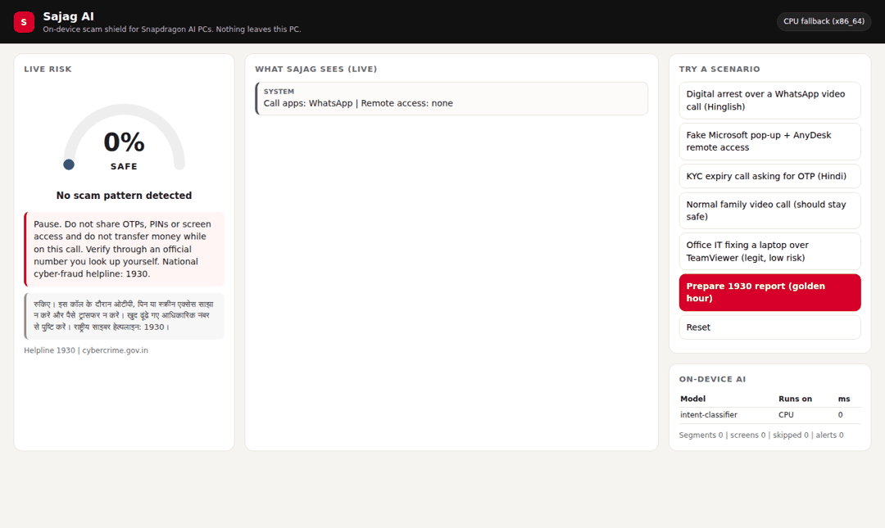
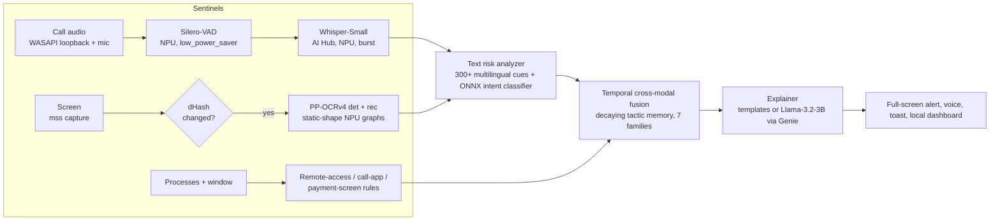

<div align="center">

# Sajag AI (सजग)

[](https://github.com/tanmaysahare/sajag-ai/actions/workflows/tests.yml)

### An on-device, multimodal scam shield for Snapdragon AI PCs

**Sees the scam on your screen. Hears it on your call. Stops it before money moves. Nothing leaves your PC.**

`Snapdragon X / X2 Elite` · `Hexagon NPU via ONNX Runtime QNN EP` · `Qualcomm AI Hub models` · `English · हिन्दी · Hinglish` · `100% offline`

Built for the **Snapdragon AI Lab Build & Present Challenge 2026** by Tanmay Sahare (IIT Kanpur)

</div>

---

## The problem

Indians lost **₹22,845 crore to cyber fraud in 2024**, a 206% jump over 2023 (MHA, Lok Sabha).
"Digital arrest" scams alone went from 39,925 cases in 2022 to **1,23,672 cases and ₹1,918 crore in 2024** (I4C data).
**7 in 10 Indians** met a tech-support scam in a single year, the highest rate in the world (Microsoft), and **47%** have faced or know someone who faced an AI voice-clone scam (McAfee).

These scams now run on the **PC**: victims are held on WhatsApp Desktop, Skype or Teams video calls for hours, shown fake CBI warrants on screen, pushed to install AnyDesk, and walked through net banking. Every existing defence (bank SMS, awareness ads, spam filters) acts *before* or *after* the call. Nothing watches the moment the scam actually happens, because doing that in the cloud would mean streaming your screen and your calls to someone else's server.

The government's own data shows awareness works: digital-arrest losses fell 66% in 2025 after SMS alerts and caller-tune campaigns. **Sajag delivers that awareness at the exact moment it matters, privately, on the device.**

## What Sajag does

| Sentinel | What it watches | On-device AI | Runs on |
|---|---|---|---|
| **Call sentinel** | Call audio from any app (WASAPI loopback + mic) | Silero-VAD gate, then **Whisper-Small** multilingual ASR (Qualcomm AI Hub) with a forced Hindi / English prompt so Hinglish is transcribed, not translated | Hexagon NPU |
| **Screen sentinel** | What is on screen: fake warrants, scareware pop-ups, payment pages | Difference-hash change gate, then **PP-OCRv4** text detection + recognition on static-shape NPU graphs | Hexagon NPU |
| **System sentinel** | Remote-access tools (AnyDesk, TeamViewer, RustDesk, 11 more), active call apps, payment screens | Rules | CPU (negligible) |
| **Risk engine** | Every transcript segment and screen | 10 scam *tactics* x 3 scripts (EN / Devanagari / Hinglish), 300+ cues, plus an ONNX **scam-intent classifier** (hashed char n-grams, 1 Gemm) | NPU / CPU |
| **Fusion** | The whole conversation, across modalities | Decaying tactic memory, cross-modal escalation rules (remote access + OTP, secrecy + authority + money), 7 scam families | CPU |
| **Explainer** | The verdict | Bilingual templates, optional **Llama-3.2-3B-Instruct** (AI Hub, Genie SDK) rephrasing | Hexagon NPU |

**Golden-hour 1930 report.** Money can often be frozen if a fraud is reported within the first hours, but victims under stress cannot recall what the caller claimed or which account they paid. One click on *Prepare 1930 report* turns the last 15 minutes of in-memory evidence into a ready-to-read complaint: claimed identities, phone numbers, UPI IDs, account numbers, IFSC codes, amounts, links, remote-access apps and a timeline, with next steps in English and Hindi. It is built only on request and never uploaded.

When risk rises to **WARNING** or **DANGER**, Sajag interrupts with a full-screen bilingual card, a spoken warning, a Windows toast, the specific reasons ("asked you to stay on the call and not tell anyone", "AnyDesk started during a call") and the national helpline **1930**.

<p align="center"></p>

## Why it has to run on the Snapdragon NPU

1. **Privacy is the product.** A scam shield that uploads your calls and screen is itself a data-leak risk. Sajag keeps audio and frames in RAM only and stores nothing unless you opt in.
2. **Always-on needs low power.** Screen OCR every 2 s and VAD every 32 ms all day is only viable on a dedicated NPU. Sajag maps each workload to an HTP power mode (`low_power_saver` for sentinels, `burst` only while a call is live).
3. **Latency decides outcomes.** The warning must land while the caller is still talking. AI Hub's published Snapdragon X Elite numbers: Whisper-Small encoder **117 ms** and decoder **10.5 ms/token**, Silero-VAD **0.07 ms** per 32 ms chunk, all layers on the NPU.
4. **Works offline**, including in the places where bank helplines and internet are least reliable.

## Architecture



Pitch deck: [docs/submission/Sajag_AI_Pitch.pdf](docs/submission/Sajag_AI_Pitch.pdf) · Project description: [docs/submission/Sajag_AI_Brief_Project_Description.pdf](docs/submission/Sajag_AI_Brief_Project_Description.pdf) · References: [docs/REFERENCES.md](docs/REFERENCES.md)

Details: [docs/architecture.md](docs/architecture.md) · NPU techniques: [docs/npu-optimization.md](docs/npu-optimization.md) · Privacy: [docs/privacy.md](docs/privacy.md)

## Models

| Role | Model | Source | Precision / runtime | Published latency, Snapdragon X Elite CRD (AI Hub) |
|---|---|---|---|---|
| Voice activity | Silero-VAD | Qualcomm AI Hub `silero_vad` | w8a16 mixed, ONNX + QNN | 0.068 ms / chunk, 51/51 layers on NPU |
| Speech to text | Whisper-Small (multilingual) | Qualcomm AI Hub `whisper_small` | float, precompiled QNN ONNX | encoder 117.1 ms, decoder 10.5 ms/token, 100% NPU |
| Speech to text (X2) | Whisper-Large-v3-Turbo | Qualcomm AI Hub | float, precompiled QNN ONNX | encoder 251 ms, decoder 4.9 ms/token on X2 Elite |
| Screen text | PP-OCRv4 det + rec | PaddleOCR via RapidOCR (open source) | static-shape fp32 graph, fp16 on HTP (QDQ w8a16 optional) | measured with `python -m sajag bench` |
| Scam intent | Sajag intent classifier | trained here (`scripts/train_classifier.py`) | [1,16384] -> Gemm -> Softmax, 0.5 MB | 0.03 ms on a laptop CPU |
| Explanation (optional) | Llama-3.2-3B-Instruct | Qualcomm AI Hub | w4a16, Genie | 11.3 tok/s, TTFT 0.12 s (42.5 tok/s on X2 Elite) |

## Results (synthetic evaluation, reproducible)

```
python scripts/evaluate.py      # writes docs/evaluation_pipeline.json
```

| Test | Result |
|---|---|
| 5 scripted end-to-end scenarios (with real OCR on rendered screens) | **5 / 5** reach the expected level |
| Digital-arrest scenario | WARNING at t = 20 s, DANGER at 26 s, **before** the money-transfer request at 45 s |
| 400 synthetic calls (200 scam, 200 benign incl. hard negatives) | **91% detected, 0.5% false alarms**, median **2 turns** to first WARNING |
| Per family | digital arrest 100%, KYC 100%, UPI refund 100%, lottery 100%, tech support 84%, investment 82%, SIM/electricity 68% |
| Full pipeline on scam scripts the classifier never saw (25% of templates withheld) | **54% detected, 0.5% false alarms**, median 2 turns |
| Intent classifier alone, template-held-out | precision 1.00, recall 0.40 (why the pattern engine and fusion exist) |
| Golden-hour report | extracts UPI IDs, phones, accounts, IFSC, amounts, links and remote apps from call + screen (tested) |

The 91% figure uses templates that overlap the training data, so it is an upper bound; the 54% held-out figure is the honest lower estimate for brand-new scripts. Validation on consented real-call recordings is the first item on the roadmap.

## Quick start

### On a Snapdragon X / X2 PC (Windows 11 on Arm, Python 3.11 ARM64)

```powershell
git clone https://github.com/tanmaysahare/sajag-ai && cd sajag-ai
powershell -ExecutionPolicy Bypass -File install.ps1   # venv + onnxruntime-qnn + models
python -m sajag doctor                                   # confirms QNNExecutionProvider / Hexagon NPU
python -m sajag run                                      # live guardian + dashboard at http://127.0.0.1:8765
```

### Anywhere (judges, CI, x86 laptops): CPU fallback, same code

```bash
pip install -r requirements.txt
python -m sajag demo                  # replays 5 scam / benign scenarios through the full pipeline
python -m sajag ui                    # dashboard with one-click scenarios
python -m sajag scan-text "Aapka KYC expire ho gaya hai, OTP bata do"
python -m pytest -q                   # 29 tests
```

| Command | Purpose |
|---|---|
| `python -m sajag run` | Live screen + call + system guardian with dashboard |
| `python -m sajag demo [name] --report` | Replay and print the golden-hour 1930 incident summary |
| `python -m sajag demo [name]` | Console replay of `digital_arrest`, `tech_support`, `kyc_otp`, `family_call`, `office_it` |
| `python -m sajag bench --out bench.json` | Latency of every model on NPU vs CPU |
| `python -m sajag fetch-models --chipset x_elite` | One-time download of AI Hub assets (Silero-VAD, Whisper-Small) |
| `python scripts/prepare_npu_models.py` | Static-shape (and optional QDQ) OCR graphs for the HTP |

## Repository layout

```
sajag/
  npu.py              ORT session factory: QNN EP, HTP power profiles, EP-context caching, strict mode
  guardian.py         orchestrates sentinels -> risk -> fusion -> alerts
  audio/              WASAPI capture, Silero-VAD, NumPy log-mel, tiktoken tokenizer, AI Hub Whisper decode loop
  vision/             screen watcher (dHash gate), NPU OCR with static-shape adapter
  signals/            remote-access / call-app / payment-screen detection
  report.py           golden-hour 1930 incident summary (entity extraction + timeline)
  risk/               multilingual scam knowledge base, analyzer, classifier, temporal fusion, explainer
  alerts/             full-screen interrupt, voice, toast
  ui/                 FastAPI + WebSocket dashboard (127.0.0.1 only, no external assets)
scripts/              corpus builder, classifier training, OCR NPU preparation, evaluation
tests/                29 unit + end-to-end tests
docs/                 architecture, NPU optimisation, privacy, evaluation, references
```

## Roadmap

1. Validate on consented, anonymised real scam-call recordings with I4C / bank partners.
2. Synthetic-voice (deepfake) detector on the NPU using AI Hub's WavLM backbone.
3. More languages: Marathi, Tamil, Telugu, Bengali (Whisper supports them; cue libraries needed).
4. Family guardian: optional alert to a trusted contact over the phone, with consent.
5. Same models on Snapdragon 8 Elite phones: AI Hub exports the identical graphs for Android.

## Responsible use

Sajag analyses *your own* screen and call audio, on *your own* PC, for *your* protection. It never records or uploads, it tells both call parties nothing, and it is not a substitute for the police. If you have lost money, call **1930** immediately or report at **cybercrime.gov.in**.

## License

Apache-2.0. Third-party models keep their own licenses (see [docs/architecture.md](docs/architecture.md#third-party-models)).
